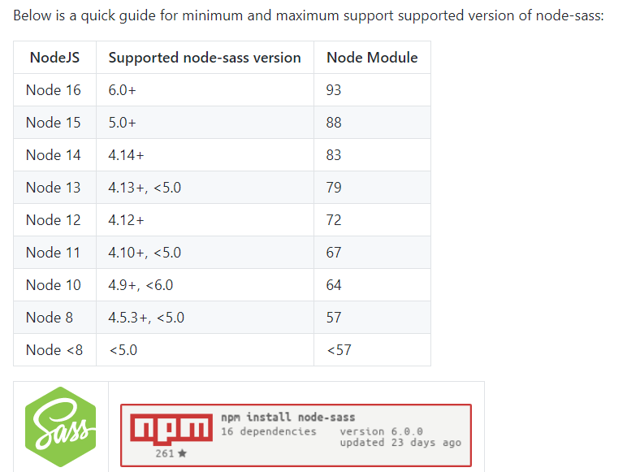

# syy-uniapp-template

### #目录结构

```
syy-uniapp-template
│   public                  // 静态文件
└───src                     // 业务逻辑代码
│   │   pages               // 主页面
│   │   api                 // http api 层
│   └── components          // 公共组件
│   │     └──global         // 全局组件
│   │        │ BaseTable     // 基础表格
│   │        │ BoxContent    // 基础Box
│   │   mixins              // mixins
│   │   store               // vuex
│   │   styles              // 公共样式文件
│   │   utils               // 工具库
│   │   global.js           // 全局模块处理
│   │   page.json    		// 页面注册、tabBar及分包等
│   │   test.ts             // 空文件，用于避免tsconfig警告
│   │   main.js             // 入口文件
```

### #使用方法：

#### 1.安装依赖

```bash
npm install
```

#### 2.根据 package 里的 script 运行项目

```bash
npm run wx
或 npm run dev
```

---

<br/>

### #不同版本：

master 分支——官方模板

uView-version 分支——引入了 uView UI 库，并安装了 sass 和 sass-loader

关于 UI 库的选择，uView 是市面上目前（2021 年 5 月）使用最多的 uniapp UI 框架，多端适配，文档齐全；

笔者还用过 ColorUI，是一款多端适配，高度自定义的 Css 组件库，但是一年多未更新 [查看说明](https://ext.dcloud.net.cn/plugin?id=239)

---

<br/>

### #可能出现的问题：

1.安装依赖失败

通常是因为 sass 下载失败，多安装几次，或者有能力的话建议翻墙

2.第一次跑项目时出错提示

例如：

```bash
TypeError: this.getOptions is not a function
```

是因为 sass 和 sass-loader 对应本地的 node 版本匹配的原因

查看自己的 node 版本 `node -v`



如图所示，比如我的 node 版本为 14，那么就应该安装 sass 4.14 版本

对应的 loader 版本为 7.3.1

```markdown
sass-loader 4.1.1，node-sass 4.3.0
sass-loader 7.0.3，node-sass 4.7.2
sass-loader 7.3.1，node-sass 4.7.2
sass-loader 7.3.1，node-sass 4.14.1
```

所以

```
npm uninstall node-sass sass-loader		//卸载sass及loader
npm install sass-loader@版本号 node-sass@版本号    //安装对应的版本
```

或者升级或降级本地 node 版本
